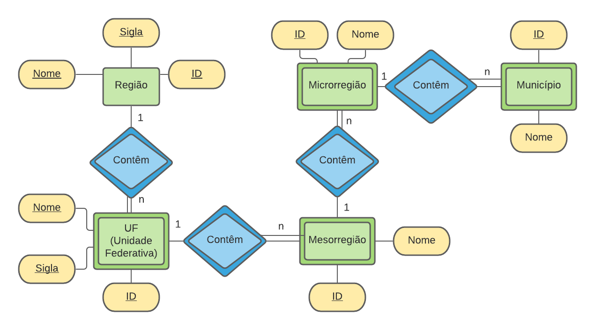
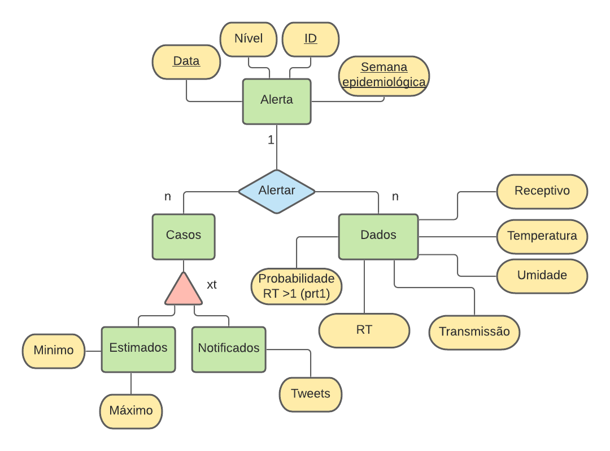

# Aluno
* Eduardo Carvalheira Teixeira de Aguiar

# RA
* 233686

## Tarefa 1 sobre APIs de acesso

* Link do Notebook com a resolução de ambos os APIs
> 

## Tarefa 2 sobre Engenharia Reversa

* Diagrama de Orquestração API - Municípios de SP e RJ
> 

* Diagrama de Orquestração API - Alerta Dengue RJ
* > 
