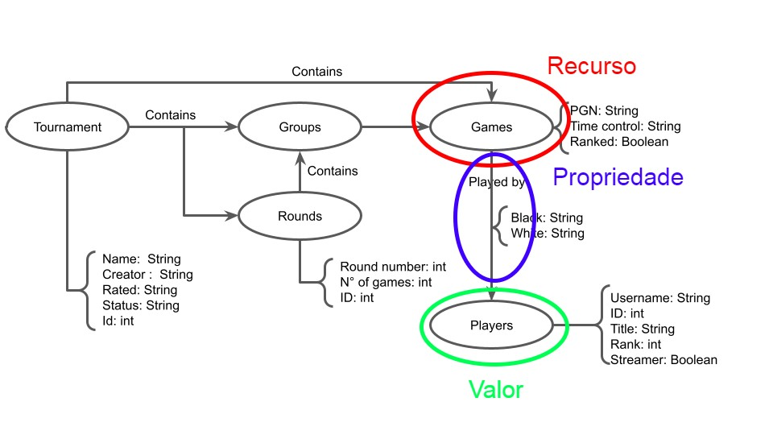

# Modelo para a Apresentação do Lab09 - Banco de dados de Grafos + Grafos de Conhecimento

# Aluno
* `233686`: `Eduardo Carvalheira Teixeira de Aguiar`

## Modelo Lógico do Banco de Dados de Grafos

• Como você publicaria seus dados ou parte dos seus dados na forma de um grafo de
conhecimento. Use um exemplo de um grafo (apresente na forma de para ilustrar o
modelo de (recurso, propriedade, valor).

> Os dados selecionados para fazerem parte de um grafo de conhecimento são as seguintes: 

> Isto pois expandiria o nosso banco de dados de acordo com jogadores diferentes, sendo possível ocorrer ligações entre eles através das partidas jogadas, como também, deixar esta parte do banco de dados de mais fácil acesso e melhor estruturada, visto a quantidade de jogadores presentes de xadrez nos sites online.

## Perguntas de Pesquisa/Análise

> * Pergunta 1 - Qual o adversário mais frequente de um Jogador X?
> * Pergunta 2 - Qual jogador apresenta a maior diversidade de oponentes em um torneio?
> * Pergunta 3 - Qual abertura é mais jogada por um jogador X de pretas de acordo com a abertura de seus oponentes?
